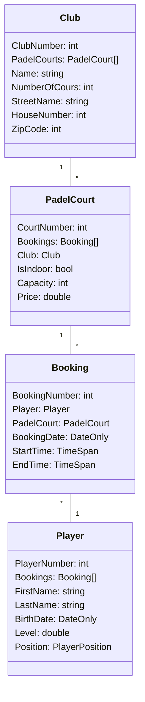

# Project .NET Fundamentals & Extended

* Naam: Elias De Hondt
* Studentennummer: 0160712-80
* Academiejaar: 2023-2024
* Klasgroep: ISB204B
* Onderwerp: Padel Club Management 
* Club 1-* PadelCourt 1-* Booking *-1 Player


#### Projects [Computer Programming 2] Second year exercises of training applied computer science at KdG.

## Sprint 6

### Request
```http request
// Request to add a new Club
POST https://localhost:7074/api/Clubs?name=Padelclub&numberOfCourts=2&streetName=Kerkstraat&houseNumber=1&zipCode=9000

// Comments:
// - Name of the club: Padel club
// - Number of lanes: 2
// - StreetName: Kerkstraat
// - House number: 1
// - Zip code: 9000
// - This request adds a new club to the database.
```

### Response
```text
HTTP/1.1 200 OK
Content-Length: 0
Date: Sat, 09 Dec 2023 15:57:01 GMT
Server: Kestrel
```

## Sprint 4



## Sprint 3

### Beide zoekcriteria ingevuld
```sql
SELECT "p"."CourtNumber", "p"."Capacity", "p"."ClubNumber", "p"."IsIndoor", "p"."PlayerNumber", "p"."Price"
FROM "PadelCourts" AS "p"
WHERE (@__price_0 IS NULL OR "p"."Price" = @__price_0) AND (@__indoor_1 IS NULL OR "p"."IsIndoor" = @__indoor_1)
```

### Enkel zoeken op price
```sql
SELECT "p"."CourtNumber", "p"."Capacity", "p"."ClubNumber", "p"."IsIndoor", "p"."PlayerNumber", "p"."Price"
FROM "PadelCourts" AS "p"
WHERE @__price_0 IS NULL OR "p"."Price" = @__price_0
```

### Enkel zoeken op indoor
```sql
SELECT "p"."CourtNumber", "p"."Capacity", "p"."ClubNumber", "p"."IsIndoor", "p"."PlayerNumber", "p"."Price"
FROM "PadelCourts" AS "p"
WHERE @__indoor_0 IS NULL OR "p"."IsIndoor" = @__indoor_0
```

### Beide zoekcriteria leeg
```sql
SELECT "p"."CourtNumber", "p"."Capacity", "p"."ClubNumber", "p"."IsIndoor", "p"."PlayerNumber", "p"."Price"
FROM "PadelCourts" AS "p"
```