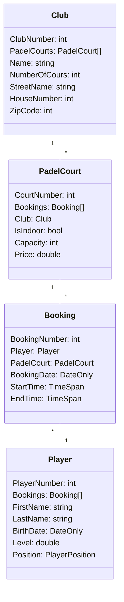

# Project .NET Fundamentals & Extended

* Naam: Elias De Hondt
* Studentennummer: 0160712-80
* Academiejaar: 2023-2024
* Klasgroep: ISB204B
* Onderwerp: Padel Club Management -> Club 1-* PadelCourt \*-\* Player


#### Rider Projects [.NET Fundamentals-Extended] Second year exercises of training applied computer science at the KdG.

## Sprint 4



## Sprint 3

### Beide zoekcriteria ingevuld
```sql
SELECT "p"."CourtNumber", "p"."Capacity", "p"."ClubNumber", "p"."IsIndoor", "p"."PlayerNumber", "p"."Price"
FROM "PadelCourts" AS "p"
WHERE (@__price_0 IS NULL OR "p"."Price" = @__price_0) AND (@__indoor_1 IS NULL OR "p"."IsIndoor" = @__indoor_1)
```

### Enkel zoeken op price
```sql
SELECT "p"."CourtNumber", "p"."Capacity", "p"."ClubNumber", "p"."IsIndoor", "p"."PlayerNumber", "p"."Price"
FROM "PadelCourts" AS "p"
WHERE @__price_0 IS NULL OR "p"."Price" = @__price_0
```

### Enkel zoeken op indoor
```sql
SELECT "p"."CourtNumber", "p"."Capacity", "p"."ClubNumber", "p"."IsIndoor", "p"."PlayerNumber", "p"."Price"
FROM "PadelCourts" AS "p"
WHERE @__indoor_0 IS NULL OR "p"."IsIndoor" = @__indoor_0
```

### Beide zoekcriteria leeg
```sql
SELECT "p"."CourtNumber", "p"."Capacity", "p"."ClubNumber", "p"."IsIndoor", "p"."PlayerNumber", "p"."Price"
FROM "PadelCourts" AS "p"
```