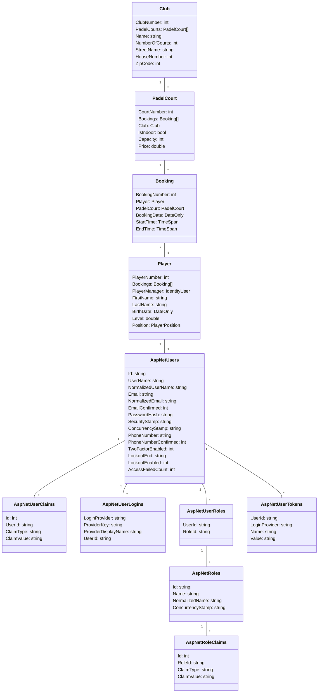

# Computer Programming 2

* Name: Elias De Hondt
* Student number: 0160712-80
* Academic year: 2023-2024
* Class group: ISB204B
* Subject: Padel Club Management
* Club 1-* PadelCourt 1-* Booking *-1 Player


## Project [Computer Programming 2] Second year exercises of training applied computer science at KdG.

## 8️⃣ Sprint

> No data available.

## 7️⃣ Sprint

### 💾Users data for testing
```json
{
  "users": [
    {
      "username": "user1@eliasdh.com",
      "email": "user1@eliasdh.com",
      "password": "User1$",
      "role": "Admin"
    },
    {
      "username": "user2@eliasdh.com",
      "email": "user2@eliasdh.com",
      "password": "User2$",
      "role": "Admin"
    },
    {
      "username": "user3@eliasdh.com",
      "email": "user3@eliasdh.com",
      "password": "User3$",
      "role": "User"
    },
    {
      "username": "user4@eliasdh.com",
      "email": "user4@eliasdh.com",
      "password": "User4$",
      "role": "User"
    },
    {
      "username": "user5@eliasdh.com",
      "email": "user5@eliasdh.com",
      "password": "User5$",
      "role": "User"
    }
  ]
}
```

### 📤HTTP Request
> This is the source file: [cookies_testing.http](UI-MVC/cookies_testing.http).
```text
###
// Request to add a new Club without authentication (1)
POST https://localhost:7074/api/Clubs HTTP/1.1
Content-Type: application/json

{
  "name": "Padel club",
  "numberOfCourts": 2,
  "streetName": "Kerkstraat",
  "houseNumber": 1,
  "zipCode": "9000"
}
###
// Request to add a new Club as an authenticated user (2)
POST https://localhost:7074/api/Clubs HTTP/1.1
Content-Type: application/json
Authorization: Bearer

{
  "name": "Another Padel Club",
  "numberOfCourts": 3,
  "streetName": "Main Street",
  "houseNumber": 42,
  "zipCode": "1000"
}
###
```
### 📥HTTP Response
> This is the source file: [cookies_testing.http](UI-MVC/cookies_testing.http).
```text
// Request to add a new Club (1)
HTTP/1.1 200 OK
Content-Length: 0
Date: Fri, 22 Dec 2023 14:21:28 GMT
Server: Kestrel

// Request to add a new Club as an authenticated user (2)
```

## 6️⃣Sprint

### 📤HTTP Request
> This is the source file: [api_testing.http](UI-MVC/api_testing.http).
```text
###
// Request to get all Clubs (1)
GET https://localhost:7074/api/Clubs HTTP/1.1
###
###
// Request to add a new Club (2)
POST https://localhost:7074/api/Clubs HTTP/1.1
Content-Type: application/json

{
    "name": "Padel club",
    "numberOfCourts": 2,
    "streetName": "Kerkstraat",
    "houseNumber": 1,
    "zipCode": "9000"
}
###
###
// Request to get a player by id (3)
GET https://localhost:7074/api/player/1 HTTP/1.1
###
###
// Request to get all Players (4)
GET https://localhost:7074/api/players HTTP/1.1
###
###
// Request to add a PadelCourt to a Player (5)
POST https://localhost:7074/api/addPadelCourtToPlayer/1/3/bookings HTTP/1.1
Content-Type: application/json

{
  "BookingDate": "2023-12-15",
  "StartTime": "10:00:00",
  "EndTime": "12:00:00"
}
###
```

### 📥HTTP Response
> This is the source file: [api_testing.http](UI-MVC/api_testing.http).
```text
// Request to get all Clubs (1)
HTTP/1.1 200 OK
Content-Type: application/json; charset=utf-8
Date: Fri, 22 Dec 2023 14:19:07 GMT
Server: Kestrel
Transfer-Encoding: chunked

// Request to add a new Club (2)
HTTP/1.1 200 OK
Content-Length: 0
Date: Fri, 22 Dec 2023 14:21:28 GMT
Server: Kestrel

// Request to get a player by id (3)
HTTP/1.1 200 OK
Content-Type: application/json; charset=utf-8
Date: Fri, 22 Dec 2023 14:21:42 GMT
Server: Kestrel
Transfer-Encoding: chunked

// Request to get all Players (4)
HTTP/1.1 200 OK
Content-Type: application/json; charset=utf-8
Date: Fri, 22 Dec 2023 14:22:37 GMT
Server: Kestrel
Transfer-Encoding: chunked

// Request to add a PadelCourt to a Player (5)
HTTP/1.1 201 Created
Content-Length: 0
Date: Fri, 22 Dec 2023 14:22:10 GMT
Server: Kestrel
Location: https://localhost:7074/api/player/1
```

## 5️⃣Sprint

> No data available.

## 4️⃣Sprint

### 📐Database diagram


## 3️⃣ Sprint 

### 🔎Both search criteria completed
```sql
SELECT "p"."CourtNumber", "p"."Capacity", "p"."ClubNumber", "p"."IsIndoor", "p"."PlayerNumber", "p"."Price"
FROM "PadelCourts" AS "p"
WHERE (@__price_0 IS NULL OR "p"."Price" = @__price_0) AND (@__indoor_1 IS NULL OR "p"."IsIndoor" = @__indoor_1)
```

### 🔎Search only by price
```sql
SELECT "p"."CourtNumber", "p"."Capacity", "p"."ClubNumber", "p"."IsIndoor", "p"."PlayerNumber", "p"."Price"
FROM "PadelCourts" AS "p"
WHERE @__price_0 IS NULL OR "p"."Price" = @__price_0
```

### 🔎Only search by indoor
```sql
SELECT "p"."CourtNumber", "p"."Capacity", "p"."ClubNumber", "p"."IsIndoor", "p"."PlayerNumber", "p"."Price"
FROM "PadelCourts" AS "p"
WHERE @__indoor_0 IS NULL OR "p"."IsIndoor" = @__indoor_0
```

### 🔎Both search criteria empty
```sql
SELECT "p"."CourtNumber", "p"."Capacity", "p"."ClubNumber", "p"."IsIndoor", "p"."PlayerNumber", "p"."Price"
FROM "PadelCourts" AS "p"
```

## Sprint 2️⃣

> No data available.

## Sprint 1️⃣

> No data available.